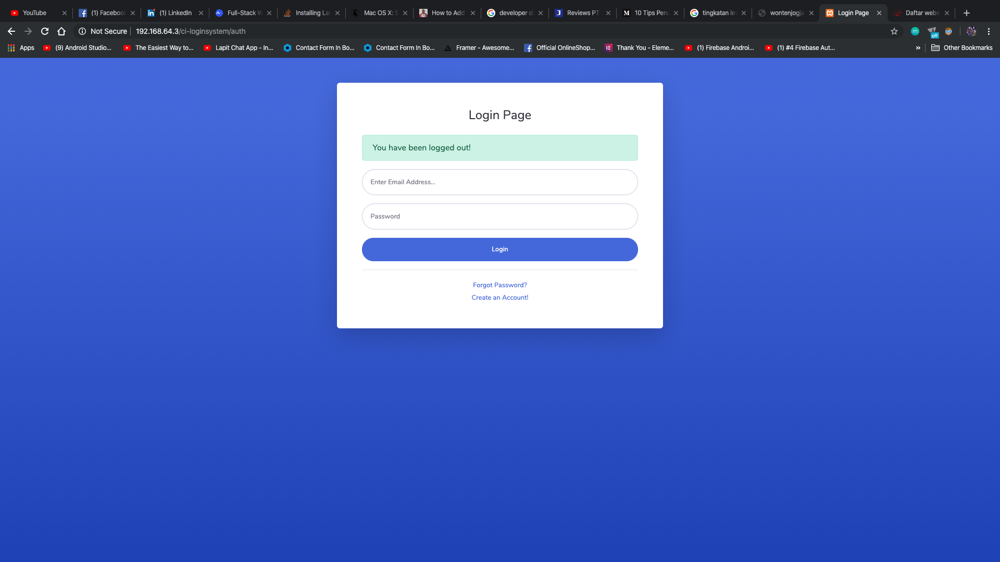
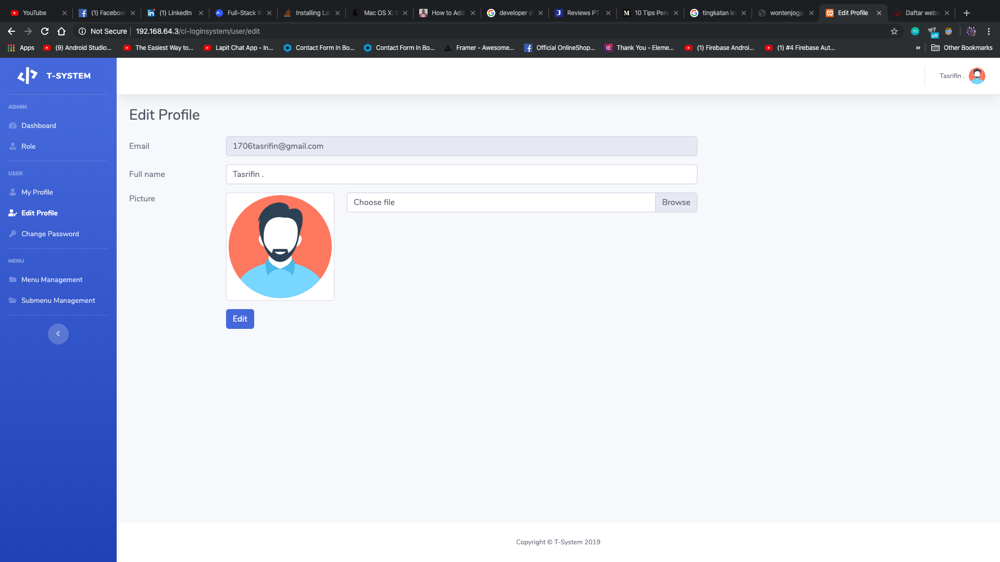
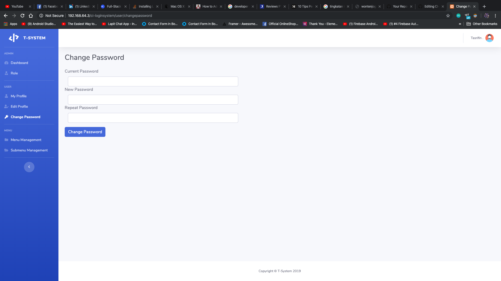
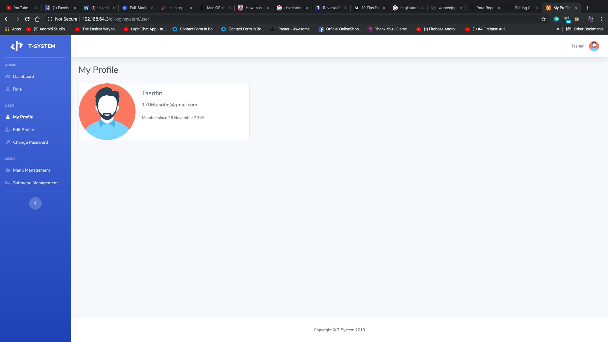
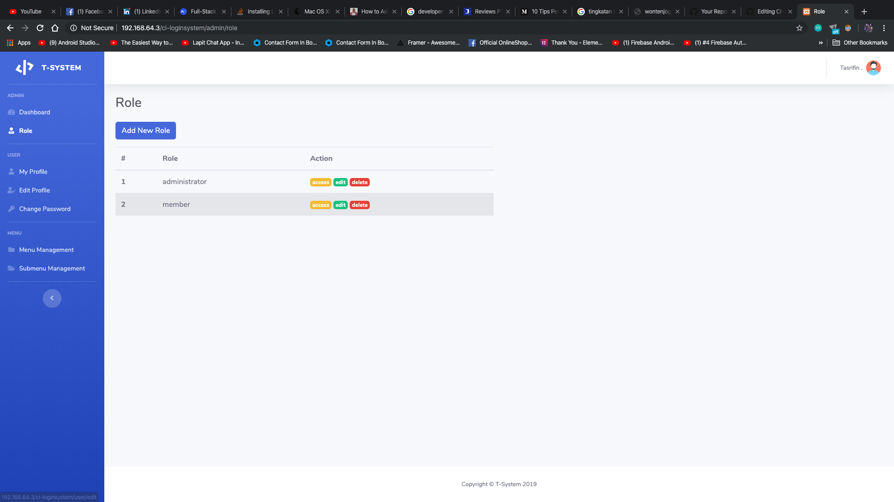
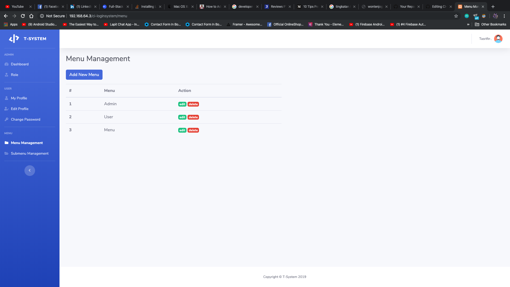
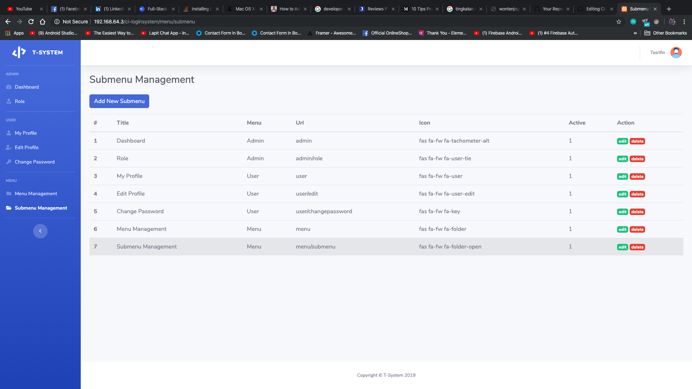

Sistem Login dengan CodeIgniter

*******************
Fitur Yang tersedia
*******************
1 Admin
  a. Submenu Dinamis
  b. Setting Role User Dinamis
  c. Profile Edit
  
2 User
  a. Dashboard
  b. Profile Edit
  
*******************
Komponen Yang Digunakan
*******************

1. PHP
2. Bootstrap (Template SB Admin 2)
3. CodeIgniter
4. AJAX

Screenshoot Program

